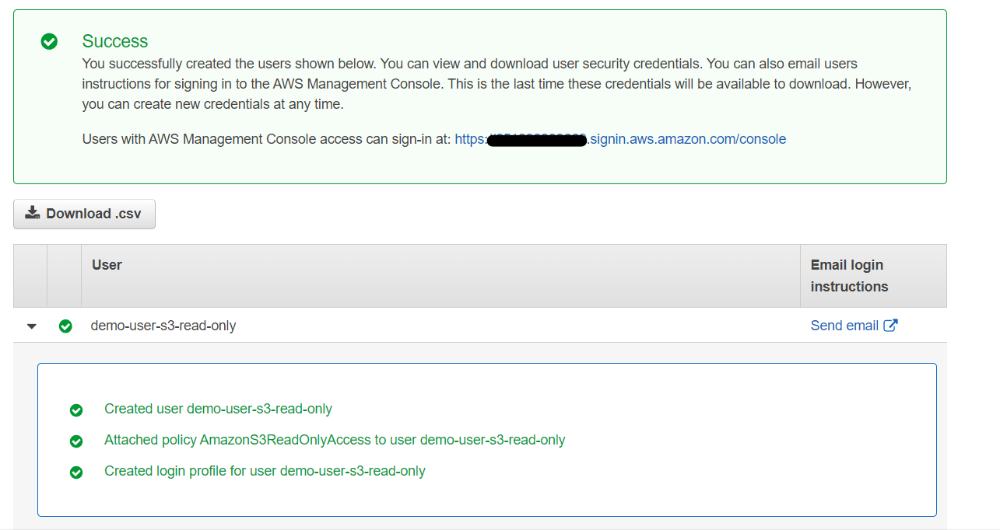
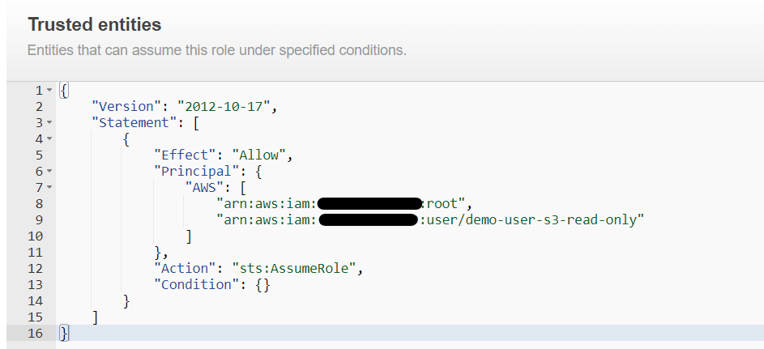

1. Add user demo-user-s3-read-only 
2. Choose Password - AWS Management Console access
3. Custom Password as "demo-user-s3-read-only"
4. Disable Require password reset checkbox
5. In permissions, choose S3 Read Only  
6. Tags, optional but recommended, add context = demo
7. Click on Review, then Create User
8. Get the link of connextion from Success message 

9. Access with the user demo-user-s3-read-only
10. Check access to EC2 service  (you will get the API ERROR Error message )
11. Click on Instances, you will get the "You are not authorized to perform this operation" error message
   
_The user will have access only to S3 in read-only that mean no other service is accessible_

12. Access to S3 service, you will see that the user can now list the buckets and its contents.
 He can event download the files

13. Go to Create Bucket with the name "demo-user-s3-read-only-s3-bucket", leave all parameters by default

_You will get an error "Failed to create bucket To create a bucket, s3:CreateBucket permissions are required."_

14. Create a new role with :
- Trusted entity type = "AWS account"
- An AWS account = "This account (xxxxxxxxx)"
- Leave the options by defaults (disabled by default)

15. Click on Next
16. In Permissions Policies, Choose "AmazonS3FullAccess"
17. Create the role with name "AssumedRoleForDemoUser"
18. Go Back to the console of user "demo-user-s3-read-only"
19. Click on Account in top right in the console
20. In the menu of the account, click on "Switch Role" 
21. Fill the form with information of : 
- Account : the designated account of the user "demo-user-s3-read-only"
- Role: The Role created in step 14
- Display Name & color :  A displayed name with a specific color to make a difference in the UI as connected user
22. Click on Switch Role
23. You will get an error in the console menu (devtools), The error is not displayed in the console

24. For we can give the user "demo-user-s3-read-only" the privilege to assume the role, we must update the trust policy to add the user as a principal
25. Go back to the console of the root/admin user, and click on "Edit Trust policy" of th role "AssumedRoleForDemoUser"
26. Add the user in the Principal object { AWS Array Object [*]}

27. Once added, you can go back to the console of "demo-user-s3-read-read" user and click on Switch Role
28. You will be redirected to the console with the assumed role, and test the creation of an s3 bucket

